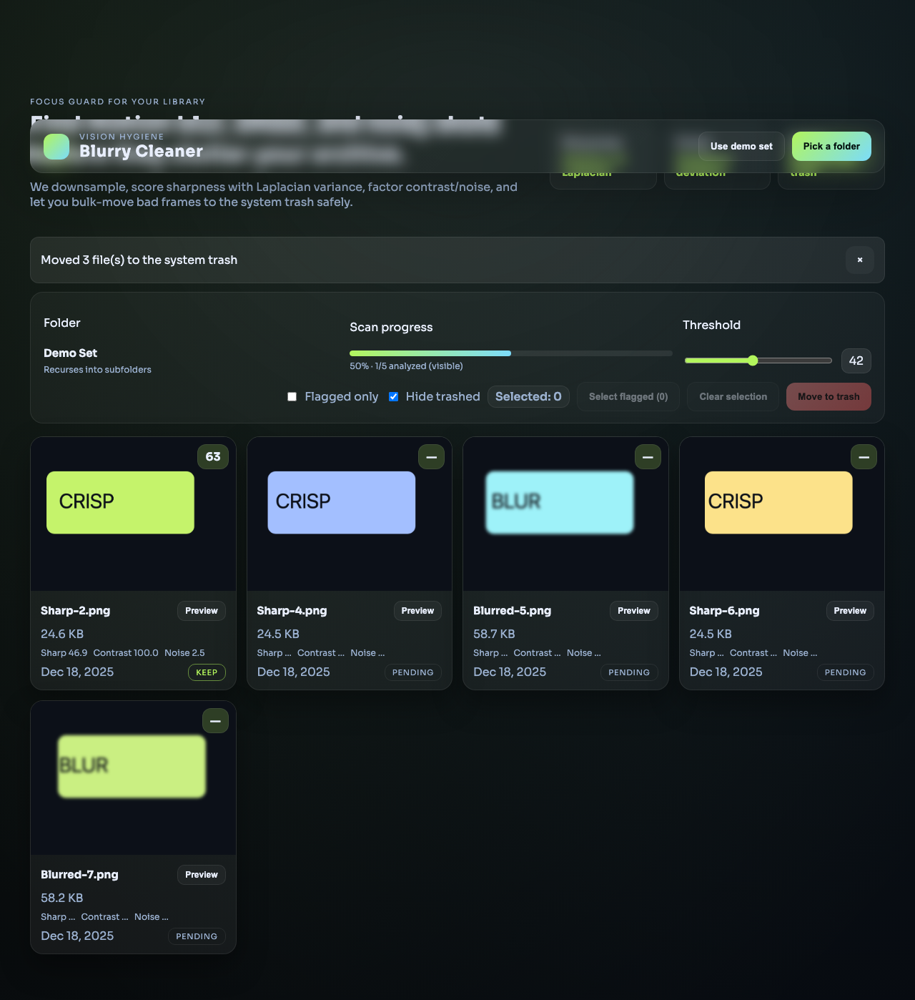

# Blurry Cleaner

Desktop app (Electron + React + Vite) to find blurry/noisy photos and move them safely to the system trash.

> macOS: после копирования в `/Applications` снимите quarantine, иначе Gatekeeper может блокировать запуск или дать чёрный экран:  
> `xattr -dr com.apple.quarantine /Applications/Blurry\\ Cleaner.app`

## Features

- Variance-of-Laplacian sharpness + contrast/noise heuristics scored 0–100.
- Recurses through subfolders; grid view with flag filters and bulk trash.
- Worker-based analysis for responsiveness; OS trash, not hard delete.
- Demo mode for quick try; Playwright e2e tests.

## Scripts

- `npm run dev` – Electron + Vite dev.
- `npm run build` – package app (DMG on macOS).
- `npm run test:e2e` – Playwright tests (mock mode).

# 
