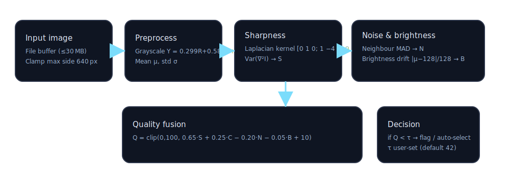
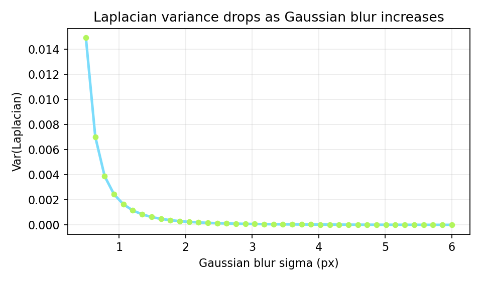

# Blurry Cleaner Quality Scoring

This document captures the current no-reference image quality pipeline used in the app. It runs entirely client-side (Electron renderer + worker) and is designed to be fast on large folders.

## Overview

- Downsample the image to a max side of 640 px to bound cost while keeping structure.
- Convert to luma (grayscale), compute mean and standard deviation.
- Measure sharpness with Laplacian variance (focus/blur detector).
- Estimate noise with mean absolute neighbour deviation.
- Penalize extreme brightness drift.
- Fuse metrics into a 0–100 quality score and classify against a user threshold.

### Pipeline diagram



## Formal definitions

Let \(I\) be the downsampled grayscale image, \(N\) its number of pixels.

**Luma conversion**
\[
Y = 0.299R + 0.587G + 0.114B
\]

**Contrast (standard deviation)**
\[
\mu = \frac{1}{N}\sum I,\quad
\sigma = \sqrt{\frac{1}{N}\sum (I-\mu)^2}
\]

**Sharpness (variance of Laplacian)**
\[
L = I * \begin{bmatrix}0&1&0\\1&-4&1\\0&1&0\end{bmatrix}, \qquad
S^2 = \operatorname{Var}(L)
\]

**Noise estimate (4-neighbour MAD)**
\[
N_{mad} = \frac{1}{N'} \sum_{p\in\text{inner}} \left| I_p - \tfrac{1}{4}\!\sum_{q\in\mathcal{N}(p)} I_q \right|
\]

**Brightness drift**
\[
B = \frac{|\,\mu - 128\,|}{128}
\]

**Score fusion (clamped to \([0,100]\))**
\[
Q = \operatorname{clip}\bigl(0,\,100,\;0.65\cdot S_n + 0.25\cdot C_n - 0.20\cdot N_n - 0.05\cdot B_n + 10 \bigr)
\]
where \(S_n,C_n,N_n,B_n\) are normalized to \([0,100]\) using empirical scalers.

**Classification**
\[
\text{keep if } Q \ge \tau;\quad
\text{maybe if } \tau - 8 \le Q < \tau + 4;\quad
\text{reject if } Q < \tau - 8
\]
Default threshold \(\tau = 42\), user-adjustable.

## Behavioural intuition

- Laplacian variance falls quickly as Gaussian blur strength grows.  
  
- High noise raises \(N_{mad}\) and reduces \(Q\).
- Low contrast or over/under-exposure slightly reduce \(Q\) to deprioritise marginal shots.

## Pseudocode

```ts
bitmap = readBufferOrUrl(path)
scaled = resizeToMaxSide(bitmap, 640)
Y = luma(scaled)
mu = mean(Y); sigma = std(Y)
L = laplacian(Y)
sharp = variance(L)
noise = meanAbsNeighbourDiff(Y)
bright = abs(mu - 128)/128

S = clamp(log10(sharp+1)*18, 0, 100)
C = clamp((sigma/80)*100, 0, 100)
N = clamp((noise/25)*100, 0, 100)
B = clamp(bright*100, 0, 100)

Q = clamp(0.65*S + 0.25*C - 0.20*N - 0.05*B + 10, 0, 100)
label = classify(Q, threshold)
```

## Implementation notes

- Analysis runs in a dedicated web worker (`src/workers/analyzer.ts`) fed by raw buffers from the main process (`readFileBuffer`), avoiding `file://` fetch failures.
- Each image is processed at most once; we cap in-flight jobs to 4 to keep the UI responsive.
- Images larger than 30 MB are skipped with an error to avoid memory spikes.
- Scores are cache-free per run for simplicity; future work could persist per-file hashes.

## Future improvements

- Add BRISQUE/NIQE as an optional WASM backstop for borderline scores.
- Learn per-camera thresholds using EXIF model metadata.
- Batch SIMD kernels (wasm-simd) to accelerate Laplacian and neighbour MAD. 
